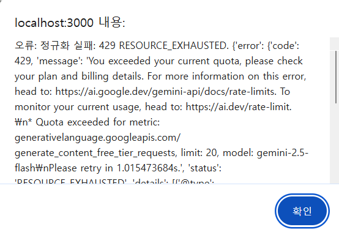
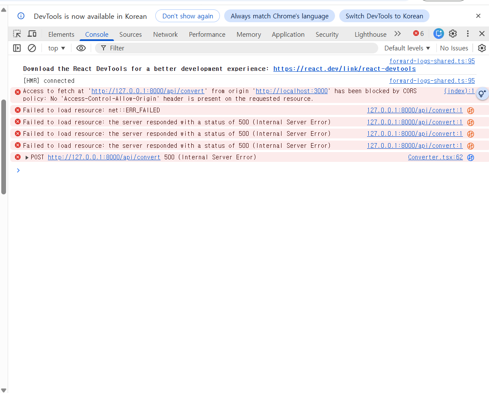
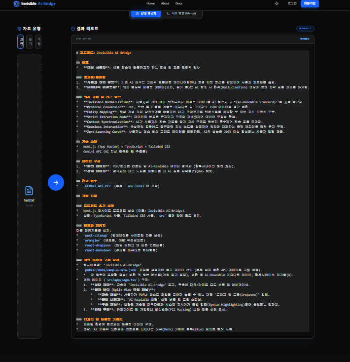

# README.md

# 🌉 Invisible AI-Bridge

> 사용자의 개입 없이 비정형 데이터를 AI 최적화 규격(AI-Readable Standard)으로 자동 정규화하여 학습 효율을 극대화하는 **지능형 데이터 가교 플랫폼**
> 

인간의 학습 방식과 AI의 데이터 처리 방식 간의 격차를 줄이기 위해, 비정형 데이터(교안, 필기 등)를 구조화된 지식 인덱스로 변환하여 **할루시네이션(Hallucination)을 억제**하고 **프롬프트 엔지니어링의 피로도를 근본적으로 해결**합니다.

---

## ✨ 핵심 기능 (Core Features)

### 1. Invisible Normalization (보이지 않는 정규화)

Zero-Learning Curve를 지향합니다. 사용자의 추가 입력이나 복잡한 프롬프트 없이 백엔드에서 비정형 데이터를 AI 최적화 규격으로 정규화하여 사용자 경험을 극대화합니다.

### 2. Protocol Conversion (프로토콜 변환)

PDF, 이미지, 텍스트 등을 **계층형 마크다운(Hierarchical Markdown)**으로 변환하여 AI가 즉각적으로 컨텍스트를 파악할 수 있는 지식 구조를 생성합니다.

### 3. Hallucination Reduction (환각 억제)

엄격한 추출 모드와 시스템 프롬프트를 통해 원본 데이터의 무결성을 유지하며, AI의 잘못된 정보 생성을 최소화합니다.

---

## 🛠 기술 스택 (Tech Stack)

### Frontend

| 항목 | 내용 |
| --- | --- |
| Framework | Next.js 14 (App Router) |
| Language | TypeScript |
| Styling | Tailwind CSS |
| UI Components | Lucide React, React Markdown |

### Backend

| 항목 | 내용 |
| --- | --- |
| Framework | FastAPI (Python 3.10+) |
| AI SDK | `google-genai` (Latest SDK) |
| AI Model | Gemini 2.5 Flash |

---

## ⚙️ 시작하기 (Getting Started)

### 1. 환경 변수 설정

프로젝트 루트 폴더에 `.env.local` 파일을 생성하고 Gemini API 키를 설정하세요.

```
GEMINI_API_KEY=your_api_key_here
```

### 2. 백엔드 서버 실행 (FastAPI)

```bash
cd backend

# 가상환경 생성 및 활성화
python -m venv .venv
source .venv/Scripts/activate  # Windows (Git Bash)
# source .venv/bin/activate    # Mac/Linux

# 의존성 설치
pip install -r requirements.txt

# 서버 실행
python main.py
```

### 3. 프론트엔드 실행 (Next.js)

```bash
# 프로젝트 루트 폴더에서 실행
npm install
npm run dev
```

---

## 📂 프로젝트 구조 (Project Structure)

```
INVISIBLE-AI-BRIDGE/
├── backend/                      # FastAPI 기반 AI 로직 및 데이터 정규화 엔진
│   ├── main.py                   # FastAPI 엔드포인트 및 Gemini 연동 로직
│   └── requirements.txt          # 백엔드 의존성
├── public/                       # 정적 파일 및 샘플 데이터
├── src/                          # Next.js 프론트엔드 소스 코드
│   ├── app/                      # App Router 페이지 (layout, page)
│   └── components/               # UI 컴포넌트 (Converter, Header, Footer 등)
├── .env.local                    # 환경 변수 (API 키)
├── next.config.ts                # Next.js 설정
├── package.json                  # 프론트엔드 의존성 및 스크립트
└── tsconfig.json                 # TypeScript 설정
```

---

## 🔌 API 엔드포인트

### `GET /api/health`

백엔드 상태 확인

### `POST /api/convert`

파일을 AI 최적화 마크다운으로 정규화합니다.

| 파라미터 | 타입 | 설명 |
| --- | --- | --- |
| `file` | UploadFile | 변환할 파일 (.txt, .pdf, .png, .jpg) |

**응답 예시:**

```json
{
  "id": "a1b2c3d4",
  "title": "lecture_notes.pdf",
  "normalized_markdown": "# 프론트엔드\n## 목표\n...",
  "hallucination_reduction": 92
}
```

### `POST /api/chat` (v2 예정)

정규화된 지식 인덱스 기반 AI 챗봇 — 현재 stub 상태입니다.

---

## 📋 AI 최적화 자료 변환 표준 (Conversion Standard)

### 데이터 타입별 Span & 가중치

| 자료 유형 | Span(청킹) 구조 | 가중치 | 핵심 변환 로직 |
| --- | --- | --- | --- |
| 선생님 교안 | 대형 (개념/단원 단위) | 1.0 | 목차(#) 기반의 지식 뼈대 구축 |
| 학생 필기 | 소형 (문장/라인 단위) | 0.5 | 개인별 키워드 및 이해도 파악 |
| 복합 자료 | 중형 (영역 매핑 단위) | 0.8 | 교안과 필기 간의 인과관계 연결 |

### 비정형 데이터 처리

- **도표 (Table)**: Markdown Table로 변환 + 표 상단에 Semantic Summary 삽입
- **이미지 (Diagram)**: Gemini Vision으로 고밀도 ALT-Text 캡션 변환 + 좌표 매핑

### 토큰 사용량 최적화 전략

1. **Vision-to-Text Compression** — 이미지/PDF는 1회만 텍스트로 캡셔닝, 이후 재전송 없음
2. **2단계 하이브리드 검색** — 핵심 Span만 Vector Search로 선별 후 최소 데이터만 API 전달
3. **Compact Markdown** — 불필요한 공백·서식·중복 코드 제거하여 순수 정보 밀도 유지

---

## 🏗 아키텍처

```
[프론트엔드 — Next.js]
  ↓ POST /api/convert { file }
[main.py — FastAPI 엔드포인트]
  ↓ 멀티모달 분기 처리 (PDF/이미지 vs 텍스트)
  ↓ Gemini 2.5 Flash 호출
  ↓ 정규화된 마크다운 반환
[프론트엔드 — 결과 리포트 렌더링]
```

---

## 🚀 로드맵 (Roadmap)

- [x]  **v1.0**: 비정형 데이터(PDF, 이미지, 텍스트) -> 계층형 마크다운 정규화 파이프라인 구축
- [ ]  **v1.5**: 자료 유형별(교안/필기) 가중치 및 특화 정규화 로직 적용
- [ ]  **v2.0**: 정규화된 지식 인덱스 기반 초개인화 AI 챗봇 연동
- [ ]  **v2.5**: 멀티모달 데이터 병합(Merge) 기능을 통한 복합 지식 인덱스 생성

---

## 📸 스크린샷

### 오류 현상


오류 스크린샷 1



오류 스크린샷 2



오류 스크린샷 3

### ✅ 구현 성공 화면



구현 성공 화면

---

## ⚠️ 알려진 이슈 & 해결 방법

### 1. CORS 차단

```
Access to fetch at 'http://127.0.0.1:8000/api/convert' from origin 'http://localhost:3000'
has been blocked by CORS policy
```

**해결:** `main.py`에 `CORSMiddleware` 추가

```python
from fastapi.middleware.cors import CORSMiddleware

app.add_middleware(
    CORSMiddleware,
    allow_origins=["http://localhost:3000"],
    allow_credentials=True,
    allow_methods=["*"],
    allow_headers=["*"],
)
```

### 2. 429 RESOURCE_EXHAUSTED — 무료 API 한도 초과

**원인:** Gemini API 무료 티어 분당 10~20회 요청 한도 초과

**해결:**

- **단기:** 30초 대기 후 재시도
- **방법 A:** 자동 재시도 로직 추가 (30초 간격, 최대 3회)
- **방법 B:** 유료 플랜 업그레이드 (분당 1,000+ RPM)
- **방법 C:** API 키 여러 개 라운드로빈 분산

### 3. 500 Internal Server Error

**원인:** 429 오류가 백엔드에서 예외 처리 없이 전파

**해결:** except 블록에서 429 전용 에러 메시지 분기

```python
except Exception as e:
    err = str(e)
    if "429" in err or "RESOURCE_EXHAUSTED" in err:
        raise HTTPException(status_code=429, detail="[무료 API 한도 초과] 약 30초 후 재시도")
    raise HTTPException(status_code=500, detail=f"정규화 중 오류: {err}")
```

---

## 📦 주요 의존성

```
# backend/requirements.txt
google-genai
python-dotenv
fastapi
uvicorn
pydantic
```

```
# package.json (주요)
next: 14.x
typescript
tailwindcss
lucide-react
react-markdown
```
